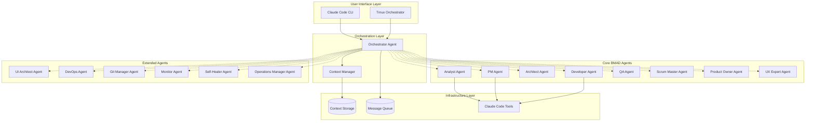
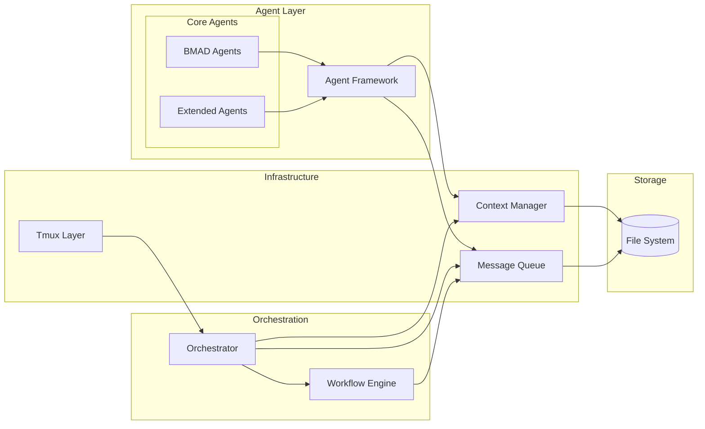
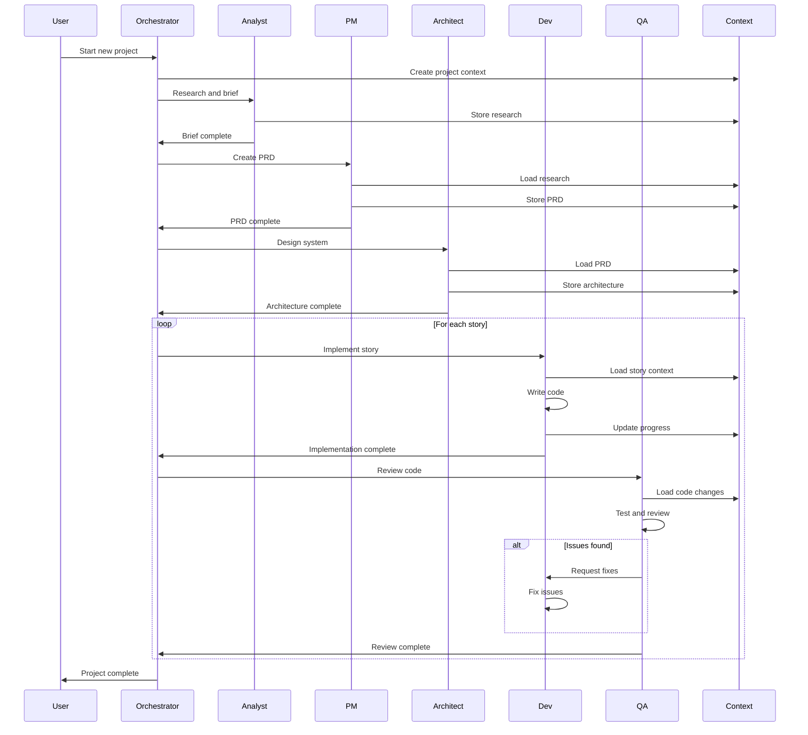
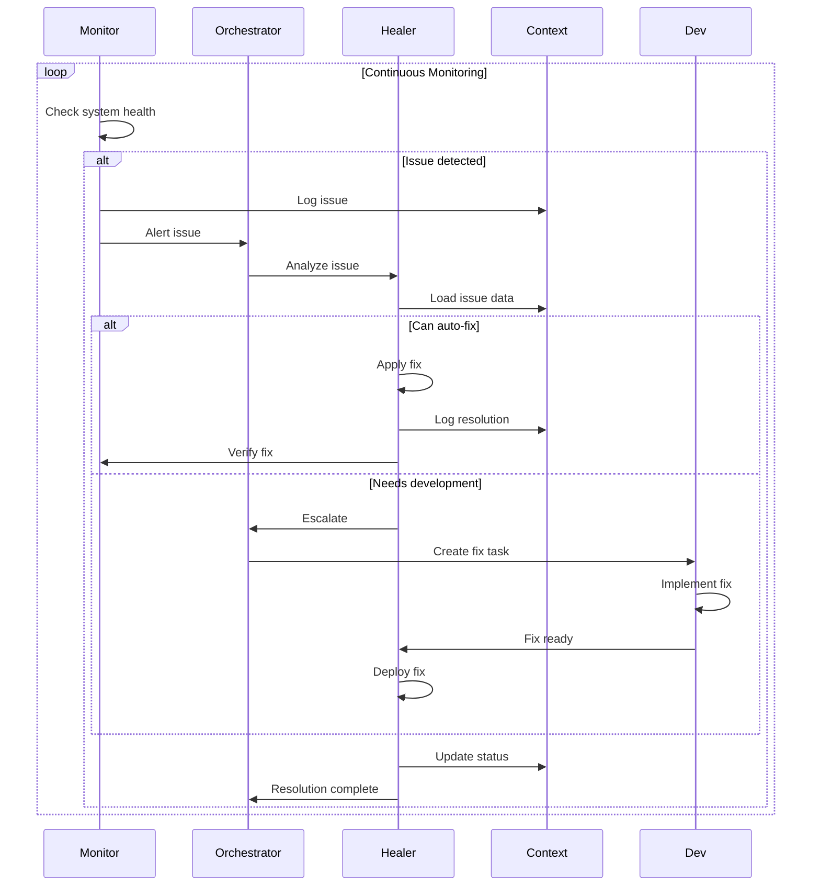

# Claude Code Agent System Architecture Document

## Introduction

This document outlines the overall project architecture for Claude Code Agent System, including backend systems, shared services, and non-UI specific concerns. Its primary goal is to serve as the guiding architectural blueprint for AI-driven development, ensuring consistency and adherence to chosen patterns and technologies.

**Relationship to Frontend Architecture:**
If the project includes a significant user interface, a separate Frontend Architecture Document will detail the frontend-specific design and MUST be used in conjunction with this document. Core technology stack choices documented herein (see "Tech Stack") are definitive for the entire project, including any frontend components.

### Starter Template or Existing Project
N/A - This is a greenfield project built specifically for Claude Code's architecture and constraints.

### Change Log
| Date | Version | Description | Author |
|------|---------|-------------|--------|
| 2025-01-27 | 1.0 | Initial architecture document | Claude Code |

## High Level Architecture

### Technical Summary
The Claude Code Agent System employs a modular agent architecture within a monorepo structure, where specialized AI agents collaborate through a hierarchical context management system. The architecture leverages Claude Code's native tool ecosystem, file-based persistence, and tmux for visual orchestration. Core patterns include event-driven communication, plugin-based agent extensibility, and self-healing capabilities. This design directly supports the PRD goals of creating a comprehensive solo-developer assistant that handles the complete software lifecycle autonomously.

### High Level Overview
The architecture follows a **Modular Agent Architecture** pattern within a **Monorepo** structure as specified in the PRD. Each agent operates as an independent module with shared infrastructure for context management and communication. The system uses an **Event-Driven** approach for agent coordination, with file-based message queuing for reliability. The primary interaction flow starts with the Orchestrator agent, which analyzes tasks and routes them to specialized agents, while the Context Manager maintains system state across all operations.

### High Level Project Diagram



### Architectural and Design Patterns

- **Modular Agent Architecture:** Independent agent modules with shared infrastructure - *Rationale:* Enables parallel development, testing, and deployment of agents while maintaining loose coupling
- **Hierarchical Context Management:** Four-level context hierarchy (Global → Project → Agent → Task) - *Rationale:* Provides organized state management with appropriate scope isolation
- **Event-Driven Communication:** File-based event system for agent coordination - *Rationale:* Ensures reliability, debuggability, and asynchronous operation without complex messaging infrastructure
- **Plugin Architecture:** Extensible agent framework with dynamic loading - *Rationale:* Allows adding new agents without modifying core system
- **Repository Pattern:** Abstract file-based storage for contexts and messages - *Rationale:* Enables future migration to databases while keeping initial implementation simple
- **Command Pattern:** Structured agent commands with validation - *Rationale:* Provides consistent interface and enables command queuing/replay
- **Observer Pattern:** Context change notifications across agents - *Rationale:* Maintains system consistency without tight coupling
- **Circuit Breaker Pattern:** Prevent cascade failures between agents - *Rationale:* Critical for system stability given Claude Code's performance degradation issues
- **Saga Pattern:** Manage distributed transactions across agents - *Rationale:* Ensures consistency in multi-agent workflows without traditional database transactions

## Tech Stack

### Cloud Infrastructure
- **Provider:** Local/On-premise initially, cloud-agnostic design
- **Key Services:** File system storage, process management, git repositories
- **Deployment Regions:** N/A (local development focus)

### Technology Stack Table

| Category | Technology | Version | Purpose | Rationale |
|----------|-----------|---------|---------|-----------|
| **Runtime** | Claude Code | Latest | AI agent runtime | Native integration with Claude's capabilities |
| **Language** | Markdown/YAML | N/A | Configuration and communication | Human-readable, AI-friendly, version control compatible |
| **Orchestration** | Tmux | 3.3+ | Visual session management | Persistent sessions, parallel execution visibility |
| **Version Control** | Git | 2.40+ | Code and context versioning | Industry standard, excellent CLI tools |
| **Context Storage** | File System | N/A | Persistence layer | Simple, reliable, debuggable |
| **Message Format** | JSON/YAML | N/A | Inter-agent communication | Structured, validatable, human-readable |
| **Documentation** | Markdown | N/A | All documentation | Compatible with all tools, renderable |
| **Testing** | Claude Code Native | N/A | Agent testing | Direct integration with agent runtime |
| **Logging** | Structured Text | N/A | Agent activity logs | Parseable, searchable, human-readable |

## Data Models

### Context
**Purpose:** Store hierarchical state information for system operation

**Key Attributes:**
- id: string - Unique identifier
- level: enum(global|project|agent|task) - Hierarchy level
- parent_id: string - Reference to parent context
- data: object - Actual context data
- version: integer - Version number for updates
- created_at: timestamp - Creation time
- updated_at: timestamp - Last modification time
- created_by: string - Agent that created context

**Relationships:**
- Parent-child hierarchy with other contexts
- Owned by specific agents
- Referenced by messages and commands

### Message
**Purpose:** Enable asynchronous communication between agents

**Key Attributes:**
- id: string - Unique message identifier
- from_agent: string - Sending agent ID
- to_agent: string - Receiving agent ID
- type: enum(command|event|response|error) - Message type
- payload: object - Message data
- context_id: string - Associated context
- timestamp: timestamp - Message creation time
- status: enum(pending|processing|completed|failed) - Processing status

**Relationships:**
- References contexts
- Can have response messages
- Part of conversation chains

### Agent
**Purpose:** Represent agent instances and their capabilities

**Key Attributes:**
- id: string - Unique agent identifier
- type: string - Agent type (analyst, dev, etc.)
- status: enum(idle|busy|error|offline) - Current status
- capabilities: array - List of supported operations
- configuration: object - Agent-specific config
- current_task: string - Active task ID
- tmux_pane: string - Associated tmux pane

**Relationships:**
- Owns contexts at agent level
- Sends and receives messages
- Executes tasks

### Task
**Purpose:** Represent units of work for agents

**Key Attributes:**
- id: string - Unique task identifier
- type: string - Task type
- agent_id: string - Assigned agent
- priority: integer - Execution priority
- dependencies: array - Task dependencies
- input_context: string - Input context ID
- output_context: string - Output context ID
- status: enum(queued|running|completed|failed) - Task status

**Relationships:**
- Assigned to agents
- Depends on other tasks
- Produces contexts

### Workflow
**Purpose:** Define multi-agent collaboration patterns

**Key Attributes:**
- id: string - Unique workflow identifier
- name: string - Workflow name
- type: enum(development|monitoring|operations|emergency) - Workflow category
- stages: array - Ordered list of stages
- current_stage: integer - Active stage index
- state: object - Workflow state data
- triggers: array - Activation conditions

**Relationships:**
- Orchestrates multiple tasks
- References agent types
- Produces audit trails

## Components

### Orchestrator Agent
**Responsibility:** Master coordinator that routes tasks to appropriate specialized agents and manages workflow execution

**Key Interfaces:**
- Task analysis and routing API
- Agent capability registry
- Workflow state management
- User command interface

**Dependencies:** Context Manager, Message Queue, all other agents

**Technology Stack:** Claude Code runtime with access to all tools, YAML-based routing rules

### Context Manager
**Responsibility:** Central state management system maintaining hierarchical contexts and enabling inter-agent data sharing

**Key Interfaces:**
- CRUD operations for all context levels
- Context querying and filtering
- Version control and history
- Event notifications for context changes

**Dependencies:** File system storage, JSON/YAML parsers

**Technology Stack:** File-based storage with JSON/YAML serialization, structured directory hierarchy

### Message Queue
**Responsibility:** Reliable asynchronous communication system between agents using file-based queuing

**Key Interfaces:**
- Message publishing
- Message consumption by agent/type
- Message status tracking
- Dead letter queue handling

**Dependencies:** File system, Context Manager

**Technology Stack:** Directory-based queue with JSON message files, file locking for concurrency

### Agent Framework
**Responsibility:** Base infrastructure providing common functionality for all agents

**Key Interfaces:**
- Agent lifecycle management
- Tool wrapper utilities
- Logging and monitoring hooks
- Configuration management

**Dependencies:** Claude Code tools, Context Manager, Message Queue

**Technology Stack:** Modular design with shared utilities, plugin architecture for extensions

### BMAD Agents Module
**Responsibility:** Collection of 10 core BMAD agents ported to Claude Code

**Key Interfaces:**
- Individual agent APIs matching BMAD specifications
- Workflow integration points
- Template processing
- Checklist execution

**Dependencies:** Agent Framework, BMAD templates and resources

**Technology Stack:** Claude Code runtime with specialized prompts and tool access per agent type

### Extended Agents Module
**Responsibility:** Additional specialized agents for complete DevOps lifecycle support

**Key Interfaces:**
- UI architecture generation
- CI/CD automation
- Git operations
- Monitoring and alerting
- Self-healing actions
- Operations management

**Dependencies:** Agent Framework, external tool integrations

**Technology Stack:** Claude Code runtime with extended tool access for DevOps operations

### Tmux Integration Layer
**Responsibility:** Visual orchestration and persistent session management

**Key Interfaces:**
- Session initialization and management
- Dynamic pane allocation
- Status display and progress tracking
- Session persistence and recovery

**Dependencies:** Tmux, Orchestrator Agent

**Technology Stack:** Tmux 3.3+ with custom scripts for agent integration

### Component Diagrams



## External APIs

*No external APIs required for core functionality. System is designed to be self-contained with optional external integrations added by specific agents as needed.*

## Core Workflows

### Product Development Workflow



### Self-Healing Workflow



## REST API Spec

*This system does not expose REST APIs as it operates entirely through Claude Code's interface and file-based communication. Agent interactions are handled through the Orchestrator's command interface.*

## Database Schema

### Context Storage Structure

```
/contexts/
├── global/
│   ├── system.yaml          # System-wide configuration
│   └── agents.yaml          # Agent registry
├── projects/
│   └── {project-id}/
│       ├── metadata.yaml    # Project metadata
│       ├── prd.yaml        # Project PRD
│       └── architecture.yaml # Project architecture
├── agents/
│   └── {agent-id}/
│       ├── config.yaml     # Agent configuration
│       ├── state.yaml      # Agent state
│       └── tasks/          # Agent tasks
└── tasks/
    └── {task-id}/
        ├── definition.yaml # Task definition
        ├── input.yaml      # Input context
        └── output.yaml     # Output context
```

### Message Queue Structure

```
/messages/
├── queues/
│   ├── {agent-id}/        # Per-agent queues
│   │   └── {msg-id}.json  # Individual messages
│   └── broadcast/         # Broadcast messages
│       └── {msg-id}.json
├── processed/             # Completed messages
│   └── {date}/
│       └── {msg-id}.json
└── dead-letter/          # Failed messages
    └── {msg-id}.json
```

## Source Tree

```
claude-code-agents/
├── .git/                          # Git repository
├── .gitignore                     # Git ignore rules
├── README.md                      # Project documentation
├── CLAUDE.md                      # Claude Code instructions
│
├── core/                          # Core infrastructure
│   ├── context-manager/          # Context management
│   │   ├── index.md             # Context manager implementation
│   │   ├── schemas/             # JSON/YAML schemas
│   │   └── tests/               # Context manager tests
│   │
│   ├── message-queue/           # Message queue system
│   │   ├── index.md            # Queue implementation
│   │   ├── handlers/           # Message handlers
│   │   └── tests/              # Queue tests
│   │
│   ├── agent-framework/        # Base agent framework
│   │   ├── base-agent.md       # Base agent class
│   │   ├── tools/              # Tool wrappers
│   │   ├── utils/              # Shared utilities
│   │   └── tests/              # Framework tests
│   │
│   └── orchestrator/           # Orchestrator agent
│       ├── index.md            # Orchestrator implementation
│       ├── router.md           # Task routing logic
│       ├── workflows/          # Workflow definitions
│       └── tests/              # Orchestrator tests
│
├── agents/                      # Agent implementations
│   ├── bmad/                   # Core BMAD agents
│   │   ├── analyst/
│   │   ├── pm/
│   │   ├── architect/
│   │   ├── developer/
│   │   ├── qa/
│   │   ├── scrum-master/
│   │   ├── product-owner/
│   │   ├── ux-expert/
│   │   ├── bmad-master/
│   │   └── shared/             # Shared BMAD resources
│   │
│   └── extended/               # Extended agents
│       ├── ui-architect/
│       ├── devops/
│       ├── git-manager/
│       ├── monitor/
│       ├── self-healer/
│       └── operations-manager/
│
├── workflows/                   # Workflow definitions
│   ├── product-development.yaml
│   ├── monitoring-healing.yaml
│   ├── operations-maintenance.yaml
│   └── emergency-response.yaml
│
├── integrations/               # External integrations
│   └── tmux/                   # Tmux orchestration
│       ├── setup.sh           # Session setup script
│       ├── layouts/           # Pane layouts
│       └── scripts/           # Helper scripts
│
├── resources/                  # Shared resources
│   ├── templates/             # Document templates
│   ├── checklists/           # Quality checklists
│   └── prompts/              # Agent prompts
│
├── tests/                     # Test suites
│   ├── unit/                 # Unit tests
│   ├── integration/          # Integration tests
│   └── e2e/                  # End-to-end tests
│
├── docs/                      # Documentation
│   ├── user-guide.md         # User documentation
│   ├── developer-guide.md    # Developer documentation
│   ├── api-reference.md      # API documentation
│   └── troubleshooting.md    # Troubleshooting guide
│
└── scripts/                   # Utility scripts
    ├── setup.sh              # Initial setup
    ├── deploy.sh             # Deployment script
    └── backup.sh             # Backup script
```

## Infrastructure and Deployment

### Infrastructure as Code
- **Tool:** Shell Scripts + YAML Configuration
- **Location:** `/scripts/` and `/config/`
- **Approach:** Declarative configuration with imperative setup scripts

### Deployment Strategy
- **Strategy:** Local-first with cloud-ready design
- **CI/CD Platform:** Git hooks + Claude Code automation
- **Pipeline Configuration:** `/.github/workflows/` (when using GitHub)

### Environments
- **Development:** Local developer machine with full agent suite
- **Testing:** Isolated test environment with mock external dependencies
- **Production:** Deployed instance with monitoring and self-healing active

### Environment Promotion Flow
```
Development -> Testing -> Production
    |            |           |
    v            v           v
 Feature     Integration  Stable
 Branches     Testing     Release
```

### Rollback Strategy
- **Primary Method:** Git revert with context restoration
- **Trigger Conditions:** Failed health checks, critical errors, manual intervention
- **Recovery Time Objective:** < 5 minutes for critical failures

## Error Handling Strategy

### General Approach
- **Error Model:** Hierarchical error types with agent-specific handling
- **Exception Hierarchy:** BaseError → AgentError → SpecificError
- **Error Propagation:** Errors logged locally, critical errors escalated to Orchestrator

### Logging Standards
- **Library:** Structured text logging to files
- **Format:** ISO8601 timestamp | level | agent | context_id | message | data
- **Levels:** DEBUG, INFO, WARN, ERROR, FATAL
- **Required Context:**
  - Correlation ID: UUID for tracking across agents
  - Service Context: agent_id, task_id, workflow_id
  - User Context: No PII, only session identifiers

### Error Handling Patterns

#### External API Errors
- **Retry Policy:** Exponential backoff, max 3 retries
- **Circuit Breaker:** Open after 5 failures, retry after 60s
- **Timeout Configuration:** 30s default, configurable per operation
- **Error Translation:** Map external errors to internal error types

#### Business Logic Errors
- **Custom Exceptions:** ValidationError, ResourceNotFound, ConflictError
- **User-Facing Errors:** Human-readable messages without technical details
- **Error Codes:** AGENT-XXXX format for tracking

#### Data Consistency
- **Transaction Strategy:** File-based atomic operations with journaling
- **Compensation Logic:** Automatic rollback on partial failures
- **Idempotency:** All operations must be safely repeatable

## Coding Standards

### Core Standards
- **Languages & Runtimes:** Markdown for documentation, YAML for configuration, Shell for scripts
- **Style & Linting:** YAML lint for configurations, Markdown lint for documentation
- **Test Organization:** Tests co-located with components in `tests/` subdirectories

### Naming Conventions
| Element | Convention | Example |
|---------|-----------|---------|
| Agents | kebab-case | context-manager |
| Files | kebab-case | agent-config.yaml |
| Contexts | snake_case | project_context |
| Messages | UUID | 550e8400-e29b-41d4-a716-446655440000 |

### Critical Rules
- **No Hardcoded Paths:** All paths must be relative or configurable
- **Context Isolation:** Agents must only access their authorized context levels
- **Message Validation:** All messages must be validated against schemas
- **Async Operations:** Long-running operations must be async with progress updates
- **Error Context:** All errors must include sufficient context for debugging

## Test Strategy and Standards

### Testing Philosophy
- **Approach:** Test-driven development for critical paths
- **Coverage Goals:** 80% for core components, 90% for Context Manager
- **Test Pyramid:** 70% unit, 20% integration, 10% e2e

### Test Types and Organization

#### Unit Tests
- **Framework:** Claude Code native testing with assertions
- **File Convention:** `{component}.test.md`
- **Location:** Co-located in `tests/` subdirectories
- **Mocking Library:** File system mocks for storage operations
- **Coverage Requirement:** 80% minimum

**AI Agent Requirements:**
- Generate tests for all public methods
- Cover edge cases and error conditions
- Follow AAA pattern (Arrange, Act, Assert)
- Mock all external dependencies

#### Integration Tests
- **Scope:** Agent interactions, workflow execution
- **Location:** `/tests/integration/`
- **Test Infrastructure:**
  - **File System:** Temporary test directories
  - **Message Queue:** In-memory queue for tests
  - **Context Manager:** Test-specific context isolation

#### End-to-End Tests
- **Framework:** Full system tests with tmux
- **Scope:** Complete workflows from user input to completion
- **Environment:** Isolated test environment
- **Test Data:** Synthetic project scenarios

### Test Data Management
- **Strategy:** Fixture-based with generated variations
- **Fixtures:** `/tests/fixtures/`
- **Factories:** Context and message factories for test data
- **Cleanup:** Automatic cleanup after each test run

### Continuous Testing
- **CI Integration:** Pre-commit hooks, PR validation
- **Performance Tests:** Response time validation for each agent
- **Security Tests:** Input validation, context access control

## Security

### Input Validation
- **Validation Library:** JSON Schema for structured data
- **Validation Location:** At agent boundaries before processing
- **Required Rules:**
  - All external inputs MUST be validated
  - Validation at API boundary before processing
  - Whitelist approach preferred over blacklist

### Authentication & Authorization
- **Auth Method:** Claude Code session-based authentication
- **Session Management:** Inherit from Claude Code runtime
- **Required Patterns:**
  - Agent-level access control for contexts
  - Task-based authorization for operations

### Secrets Management
- **Development:** Environment variables, never in code
- **Production:** Secure file storage with restricted access
- **Code Requirements:**
  - NEVER hardcode secrets
  - Access via configuration service only
  - No secrets in logs or error messages

### API Security
- **Rate Limiting:** Per-agent operation limits
- **CORS Policy:** N/A (not web-based)
- **Security Headers:** N/A (not web-based)
- **HTTPS Enforcement:** N/A (local file-based)

### Data Protection
- **Encryption at Rest:** Rely on OS file system encryption
- **Encryption in Transit:** N/A (local file operations)
- **PII Handling:** No PII storage in contexts or logs
- **Logging Restrictions:** No sensitive data, no credentials, no PII

### Dependency Security
- **Scanning Tool:** Regular Claude Code updates
- **Update Policy:** Follow Claude Code update cycle
- **Approval Process:** Review before adding external dependencies

### Security Testing
- **SAST Tool:** Code review by security-focused agent
- **DAST Tool:** Runtime security validation
- **Penetration Testing:** Manual security review quarterly

## Performance and Scaling Considerations

### Token Usage Optimization
- **Context Compression:** Implement aggressive summarization before storing contexts
- **Selective Loading:** Load only required context sections per agent task
- **Token Budgeting:** Each agent allocated maximum tokens per operation
- **Context Pruning:** Regular cleanup of old contexts to prevent accumulation

### Performance Management
- **Session Limits:** Mandatory reset after 2 hours to prevent degradation
- **Agent Pools:** Rotate between agent instances to distribute load
- **Batch Operations:** Group related operations to minimize context switches
- **Caching Strategy:** Cache frequently accessed contexts in memory

### Scaling Limitations
- **Concurrent Agents:** Maximum 2-3 agents active simultaneously
- **File Lock Contention:** Implement exponential backoff for file access
- **Context Size Limits:** Individual context files must stay under 100KB
- **Workflow Timeouts:** Maximum 30 minutes per workflow execution

### Cost Control Mechanisms
- **Token Tracking:** Real-time monitoring of token usage per agent
- **Cost Alerts:** Automatic alerts when approaching budget limits
- **Workflow Budgets:** Pre-allocated token budgets per workflow type
- **Emergency Shutdown:** Kill switch when costs exceed thresholds

## Checklist Results Report

*To be completed after architecture review and validation*

## Next Steps

The architecture is now ready for implementation. Key next steps:

1. **Begin with Epic 1:** Foundation & Core Infrastructure
   - Set up the monorepo structure
   - Implement Context Manager
   - Create Agent Framework base classes

2. **Set up Development Environment:**
   - Initialize git repository
   - Create directory structure
   - Set up tmux integration

3. **Start Agent Development:**
   - Begin with Orchestrator agent
   - Port BMAD agents incrementally
   - Add extended agents as needed

### Architect Prompt

*For Frontend Architecture (if needed):*
Create a Frontend Architecture document for any UI components of the Claude Code Agent System, focusing on terminal-based interfaces, tmux integration, and command-line user experience. Use this architecture document as the foundation for technology choices and patterns.