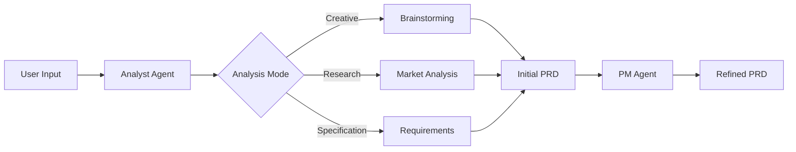
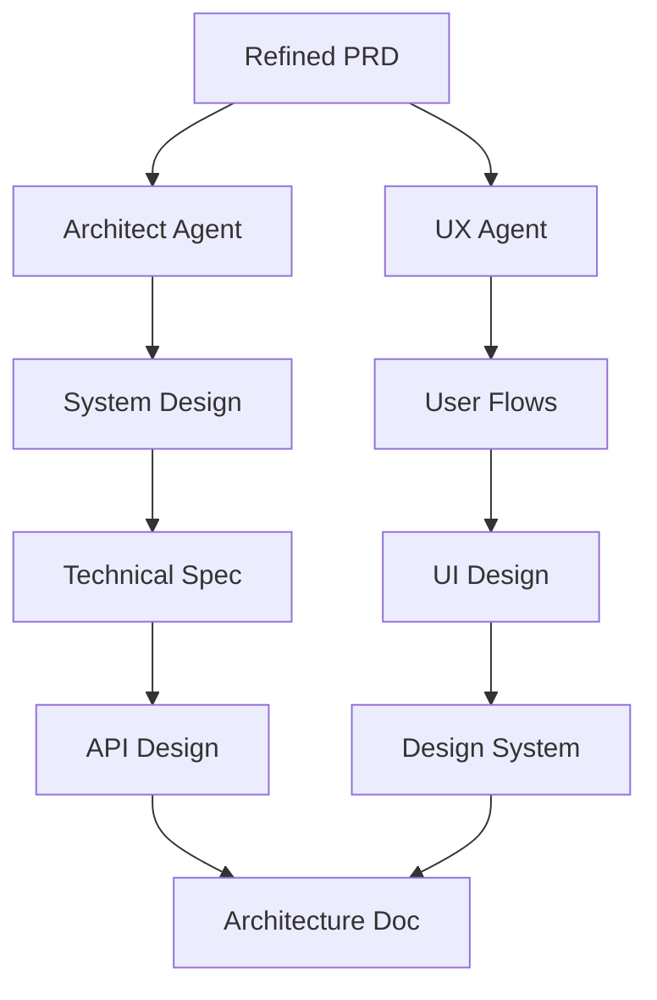
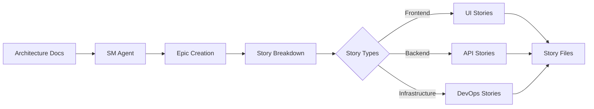
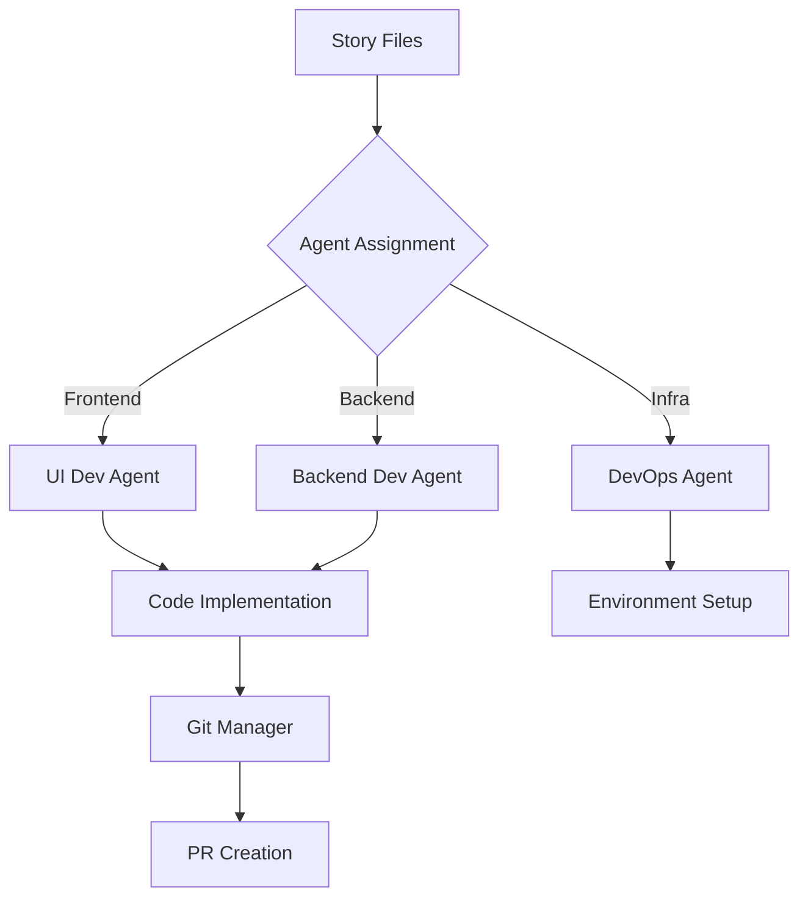
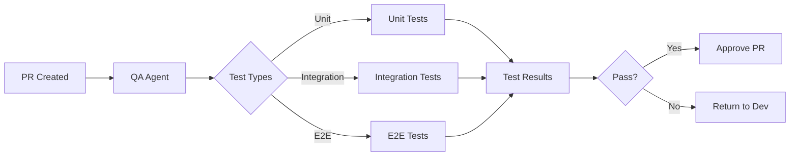
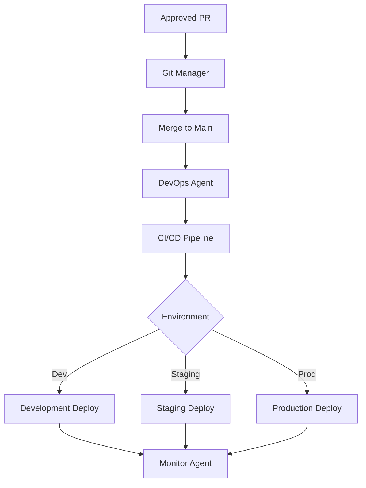
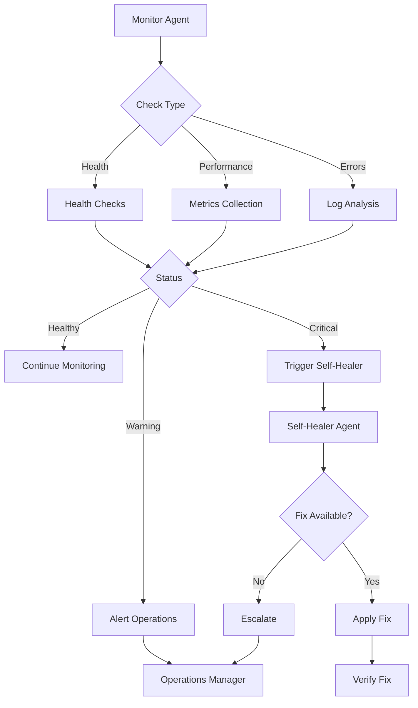
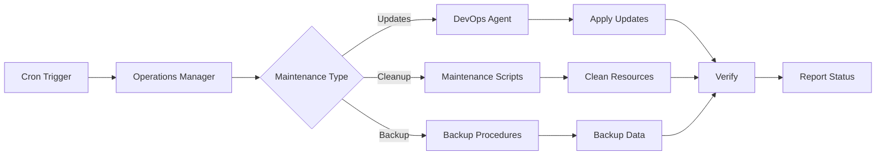
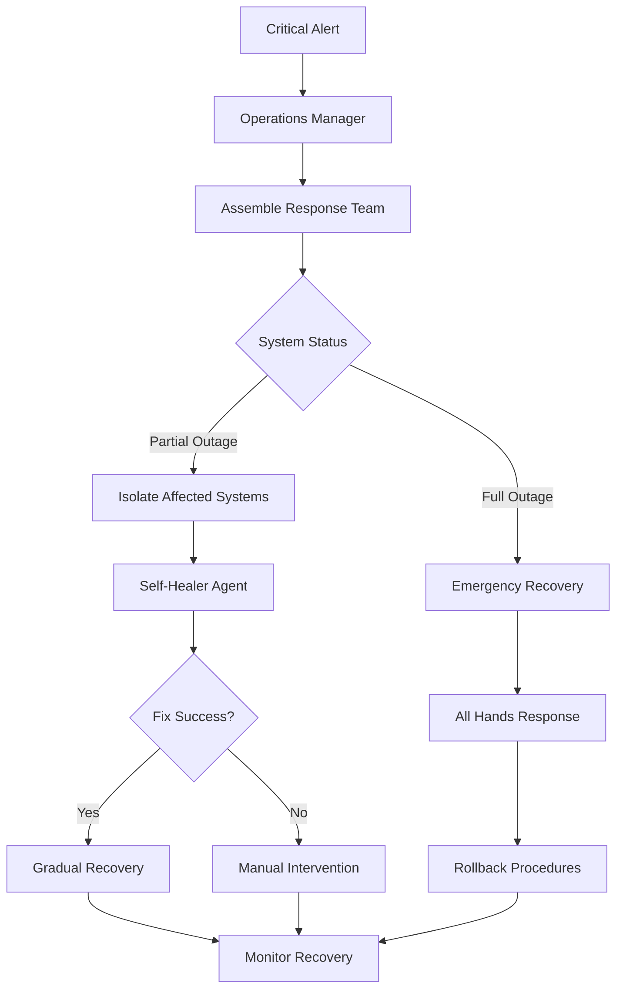

# Workflow Design for Claude Code BMAD Implementation

## Product Development Workflow (Ideation → Deployment)

### Phase 1: Ideation & Requirements


**Workflow Steps**:
1. **Activation**: User provides initial idea or requirements
2. **Analyst Processing**:
   ```json
   {
     "phase": "ideation",
     "mode": "creative|research|specification",
     "outputs": [
       "/docs/requirements/initial-prd.md",
       "/docs/research/market-analysis.md"
     ]
   }
   ```
3. **PM Refinement**:
   - Validates business value
   - Creates feature roadmap
   - Defines success metrics
4. **Handoff**: PRD → Architecture phase

### Phase 2: Architecture & Design


**Parallel Execution**:
```yaml
architecture_phase:
  parallel_agents:
    - name: architect
      tasks:
        - system_design
        - api_specification
        - data_modeling
    - name: ux
      tasks:
        - user_flows
        - wireframes
        - design_system
    - name: ui_architect
      tasks:
        - component_architecture
        - state_management
        - frontend_patterns
```

### Phase 3: Sprint Planning


**Story File Structure**:
```yaml
story:
  id: "3.6.16"
  epic: "3.6"
  title: "Implement WebRTC peer connection"
  context:
    from_prd: "Video calling feature"
    from_arch: "WebRTC architecture section 3.2"
    dependencies: ["3.6.15"]
  implementation:
    files_to_modify:
      - path: /client/src/services/webrtc.ts
        changes: "Add peer connection logic"
    new_files:
      - path: /client/src/hooks/useWebRTC.ts
        template: "webrtc-hook"
  acceptance_criteria:
    - "Peer connection establishes successfully"
    - "STUN/TURN servers configured"
    - "Connection state handling implemented"
```

### Phase 4: Development


**Development Orchestration**:
```python
# Pseudo-code for development workflow
def development_workflow(story):
    # 1. Assign to appropriate dev agent
    agent = assign_agent(story.type)
    
    # 2. Load context
    context = {
        "story": story,
        "architecture": load_architecture(),
        "design_system": load_design_system(),
        "dependencies": resolve_dependencies(story)
    }
    
    # 3. Implementation
    result = agent.implement(context)
    
    # 4. Validation
    if qa_agent.validate(result):
        git_manager.create_pr(result)
    else:
        return to_dev_agent(result, qa_feedback)
```

### Phase 5: Quality Assurance


### Phase 6: Deployment


## Monitoring and Self-Healing Workflow

### Continuous Monitoring Loop


**Monitoring Configuration**:
```yaml
monitoring:
  health_checks:
    - endpoint: /api/health
      interval: 30s
      timeout: 5s
    - service: database
      check: connection_pool
      threshold: 80%
  
  performance_metrics:
    - metric: response_time
      threshold: 200ms
      action: alert
    - metric: memory_usage
      threshold: 80%
      action: scale
  
  error_patterns:
    - pattern: "WebRTC connection failed"
      severity: high
      action: self_heal
    - pattern: "Database timeout"
      severity: critical
      action: escalate
```

### Self-Healing Procedures
```yaml
self_healing_procedures:
  webrtc_connection_failure:
    diagnosis:
      - check: stun_server_connectivity
      - check: turn_server_authentication
      - check: firewall_rules
    
    fixes:
      - name: restart_webrtc_service
        script: |
          systemctl restart webrtc-service
          sleep 5
          curl -f http://localhost:8080/health/webrtc
      
      - name: refresh_turn_credentials
        script: |
          ./scripts/refresh-turn-creds.sh
          ./scripts/update-client-config.sh
    
    verification:
      - test: establish_test_connection
      - test: verify_media_streams
```

## Operations & Maintenance Workflow

### Scheduled Maintenance


### Incident Response
```yaml
incident_response:
  levels:
    - name: low
      agents: [monitor]
      response_time: 1h
      
    - name: medium
      agents: [monitor, operations_manager]
      response_time: 15m
      
    - name: high
      agents: [monitor, operations_manager, dev]
      response_time: 5m
      
    - name: critical
      agents: [all_available]
      response_time: immediate
  
  workflow:
    detection:
      agent: monitor
      output: incident_report
    
    triage:
      agent: operations_manager
      actions:
        - assess_severity
        - identify_affected_systems
        - assign_responders
    
    resolution:
      agents: [assigned_responders]
      steps:
        - diagnose_issue
        - implement_fix
        - verify_resolution
        - document_incident
    
    post_mortem:
      agent: operations_manager
      outputs:
        - incident_timeline
        - root_cause_analysis
        - prevention_measures
```

## Emergency Response Workflow

### Critical Failure Response


**Emergency Protocols**:
```yaml
emergency_protocols:
  data_corruption:
    immediate_actions:
      - stop_writes_to_affected_systems
      - create_snapshot_of_current_state
      - notify_all_stakeholders
    
    recovery_steps:
      - identify_corruption_extent
      - restore_from_last_known_good
      - replay_transaction_logs
      - verify_data_integrity
  
  security_breach:
    immediate_actions:
      - isolate_affected_systems
      - revoke_all_access_tokens
      - enable_emergency_logging
    
    response_team:
      - security_specialist
      - operations_manager
      - senior_developer
      - devops_lead
```

## Workflow Integration Points

### Agent Handoff Protocol
```json
{
  "handoff_protocol": {
    "pre_handoff": {
      "save_state": true,
      "create_summary": true,
      "update_context": true
    },
    "handoff_message": {
      "from_agent": "architect",
      "to_agent": "scrum_master",
      "timestamp": "2025-07-27T10:00:00Z",
      "artifacts": [
        "/docs/architecture/system-design.md",
        "/docs/architecture/api-spec.yaml"
      ],
      "context": {
        "completed_tasks": ["system_design", "api_design"],
        "pending_tasks": ["story_creation"],
        "notes": "Focus on WebRTC stories first"
      }
    },
    "post_handoff": {
      "verify_receipt": true,
      "confirm_understanding": true,
      "start_tracking": true
    }
  }
}
```

### State Synchronization
```yaml
state_sync:
  frequency: 5m
  strategy: eventual_consistency
  
  sync_points:
    - agent_handoff
    - phase_completion
    - error_occurrence
    - manual_trigger
  
  conflict_resolution:
    strategy: last_write_wins
    audit_trail: true
    notification: affected_agents
```

## Performance Optimization

### Parallel Execution Rules
1. **Planning Phase**: Up to 3 agents (Analyst, PM, UX)
2. **Architecture Phase**: Up to 4 agents (Architect, UI-Architect, UX, DevOps)
3. **Development Phase**: Up to 5 agents (multiple Dev agents by component)
4. **Testing Phase**: Up to 3 agents (QA, Performance, Security)

### Resource Management
```yaml
resource_limits:
  per_agent:
    cpu: 2_cores
    memory: 4GB
    disk: 10GB
    
  global:
    max_concurrent_agents: 8
    max_memory: 32GB
    max_api_calls: 1000/hour
```

## Workflow Metrics

### Key Performance Indicators
```yaml
kpis:
  development_velocity:
    metric: stories_completed_per_sprint
    target: 20
    
  quality:
    metric: defect_escape_rate
    target: < 5%
    
  deployment_frequency:
    metric: deploys_per_day
    target: 3
    
  mean_time_to_recovery:
    metric: incident_resolution_time
    target: < 30m
    
  agent_efficiency:
    metric: tasks_completed_per_hour
    target: 5
```